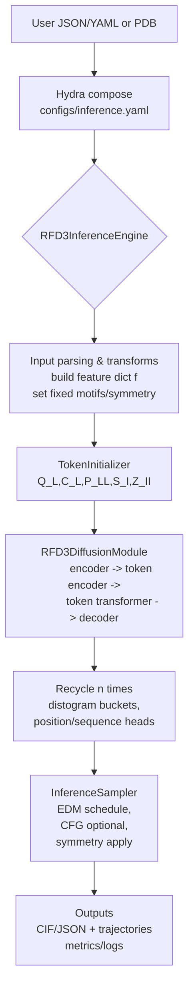
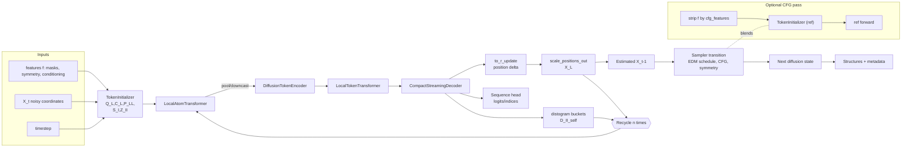
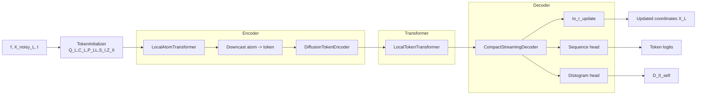

# RFdiffusion3 (RFD3) – Architecture & Pipeline

This document summarizes how the RFD3 model in `models/rfd3` is organized and how inference/training flow through the codebase.

## High-level purpose
RFD3 is an AlphaFold3-inspired diffusion model for de novo biomolecular interaction design. It denoises atom-level coordinates while optionally predicting sequences, supporting diverse conditioning tasks (motifs, nucleic acids, small molecules, symmetry, etc.).

## Repository layout (RFD3-specific)
- `src/rfd3/engine.py` – inference engine that orchestrates parsing inputs, composing Hydra configs, running batches, and saving CIF/JSON outputs.
- `src/rfd3/cli.py` – Typer CLI (`rfd3 design ...`) that composes Hydra configs and calls the engine.
- `src/rfd3/model/` – core model: `RFD3` wrapper, diffusion module, sampler, layer building blocks, cfg utilities.
- `src/rfd3/trainer/` – Lightning-Fabric trainer (`AADesignTrainer`), recycling schedule, validation dump helpers.
- `src/rfd3/transforms/` – data transforms/conditioning pipelines for training & inference (motifs, symmetry, hbonds, NA/ppi, etc.).
- `configs/` – Hydra defaults for inference, model, trainer, datasets, callbacks, logging.
- `docs/` – user docs & examples; `.json` example inputs live in `docs/examples/`.

## Inference stack
1. **CLI entry** (`rfd3 design ...`): `cli.py` composes `configs/inference.yaml` plus overrides. If no engine provided, defaults to `inference_engine=rfdiffusion3`.
2. **Inference engine** (`engine.py`, class `RFD3InferenceEngine`):
   - Loads inputs from JSON/YAML or PDB via `rfd3.inference.input_parsing`.
   - Applies optional `specification` overrides and validates inputs.
   - Builds data loader via `assemble_distributed_inference_loader_from_json`.
   - Instantiates model + sampler using checkpoint config, applying overrides from Hydra.
   - Iterates batches, calling `AADesignTrainer.validation_step` to run forward diffusion rollout and collect metrics.
   - Dumps outputs as `.cif.gz` (plus trajectories if requested) and metadata JSON.
3. **Sampler** (`model/inference_sampler.py`):
   - Constructs EDM-style noise schedule (AF3 supplement) with optional partial diffusion.
   - Initializes noisy structure (motif atoms can be kept fixed; optional jitter).
   - Steps through schedule calling diffusion module; supports classifier-free guidance and symmetry handling.
   - Optionally realigns motif each step and collects trajectories/entropy.

## Model core (`model/RFD3.py` + `model/RFD3_diffusion_module.py`)
- **TokenInitializer**: builds initial per-atom (`Q_L`, `C_L`, pairwise `P_LL`) and per-token (`S_I`, `Z_II`) features from parsed inputs (`f`). Supports chunked pairwise mode (`RFD3_LOW_MEMORY_MODE=1`).
- **DiffusionModule** (`RFD3DiffusionModule`): UNet-like, recycling architecture:
  - Time embedding via Fourier embeddings -> projection into atom/token channels.
  - **LocalAtomTransformer encoder**: atom-level self-attention using neighborhood indices (`create_attention_indices`) and optional chunked pairwise embedder.
  - Downcasts pooled atom reps to token space (`Downcast`) and sequence head prep.
  - **DiffusionTokenEncoder**: fuses token + pairwise features with current coordinates; updates `S_I`, `Z_II`.
  - **LocalTokenTransformer**: token-level attention operating on CA positions; optional full attention unless low-memory.
  - **CompactStreamingDecoder**: cross-updates atom/token streams; outputs refined atom reps (`Q_L`) and auxiliary heads.
  - **Output heads**: position update head (`to_r_update`), scaling back to coordinates (EDM / noise_pred / unconditioned), sequence logits via `LinearSequenceHead`, pairwise distogram bucketing for recycling.
  - **Recycling**: `forward_with_recycle` reuses outputs (`X_L`, `D_II_self`) for `n_recycle` iterations (train: provided; eval: config default).
- **Classifier-free guidance**: optional, strips conditioning features (`cfg_features`) for reference pass, blended inside sampler.

## Training loop (`trainer/rfd3.py`)
- Trainer (`AADesignTrainer`) extends `FabricTrainer` (Lightning Fabric):
  - Assembles network inputs (noisy coords + timestep + feature dict), handles NaNs, and enforces shape checks.
  - Randomizes recycle count per example using schedule from `trainer/recycling.py`.
  - Loss/metrics configured via Hydra (`configs/trainer/loss/` and `configs/trainer/metrics/`).
  - Validation/test phases also use full diffusion rollout; metrics include backbone, hbonds, design quality.

## Data & conditioning pipeline
- **Transforms** (`transforms/pipelines.py`, `design_transforms.py`, `training_conditions.py`, etc.): build feature dict `f` with atom/token mappings, masks for fixed motifs, symmetry constraints, NA/small-molecule conditioning, hbonds (HBPLUS), virtual atoms, and RASA.
- **Input specs**: JSON/YAML schemas in `docs/input.md`; convenience examples in `docs/examples/*.json` with matching markdown guides.
- **Hydra configs**: 
  - `configs/inference_engine/*.yaml` set engine defaults (batch size, sampler params, cleanup flags).
  - `configs/model/rfd3_base.yaml` wires channels (`c_atom`, `c_atompair`, `c_s`, `c_z`), module choices, and sampler defaults.
  - `configs/model/samplers/*.yaml`, `schedulers/*.yaml`, `optimizers/*.yaml` provide swap-in components.

## Outputs
- Structures written as `*.cif.gz` (and optionally denoised/noisy trajectories) with conditioning annotations (`SAVED_CONDITIONING_ANNOTATIONS`).
- Metadata JSON per design includes seeds, cfg parameters, metrics, and alignment info.

## Mermaid overview

## Model architecture

   Key signals: `f` (conditioning features), `X_t` (coordinates at current step), `t` (noise level). The recycle loop re-feeds updated positions and pairwise buckets to the encoder/decoder stack for iterative refinement.

## Module breakdown (encoder, transformer, decoder)

## Detailed execution order (single diffusion step)
1. Build conditioning and geometry inputs:
   - `f` carries token/atom mappings, masks, motif constraints, symmetry metadata, and optional conditioning features.
   - `X_noisy_L` and `t` define the current diffusion state.
2. Run `TokenInitializer`:
   - Produces atom stream states (`Q_L`, `C_L`), atom-pair states (`P_LL`), and token stream states (`S_I`, `Z_II`).
3. Run atom encoder path:
   - `LocalAtomTransformer` updates atom-local context from neighborhood attention.
   - `Downcast` pools atom information into token-aligned channels.
4. Run token encoder/transformer path:
   - `DiffusionTokenEncoder` fuses token states with pairwise/context and current coordinates.
   - `LocalTokenTransformer` performs token-level attention updates.
5. Decode and project outputs:
   - `CompactStreamingDecoder` mixes token and atom streams back into refined atom states.
   - Position head (`to_r_update`) predicts coordinate delta; sequence head predicts token logits.
   - Distogram head produces `D_II_self` for recycle context.
6. Recycle boundary:
   - `scale_positions_out` returns updated coordinates `X_L`.
   - (`X_L`, `D_II_self`) are fed into the next recycle iteration when `n_recycle > 0`.
7. Sampler update:
   - `InferenceSampler` applies schedule logic (EDM-style), optional CFG blending, and optional symmetry constraints to produce the next step state.

## Recycle state summary
- Position state: `X_L` (updated coordinates after output scaling).
- Pairwise memory: `D_II_self` (distogram buckets used as iterative context).
- Conditioning state: `f` remains fixed unless explicitly modified by CFG feature stripping in the reference pass.

## Quick references
- Run inference: `rfd3 design out_dir=<dir> inputs=models/rfd3/docs/examples/demo.json dump_trajectories=True prevalidate_inputs=True`.
- Model toggle: set `RFD3_LOW_MEMORY_MODE=1` to enable chunked pairwise embeddings.
- CFG features controlled via `inference_sampler.cfg_features` (see default list in `configs/inference_engine/rfdiffusion3.yaml`).
- Symmetry sampler: `inference_sampler.kind=symmetry` plus symmetry spec in input JSON.
