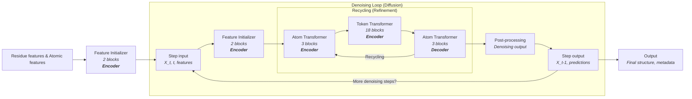
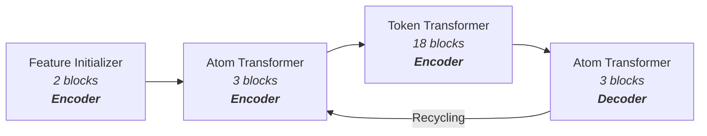

# RFD3 Model Architecture: Denoising and Recycling Loops

This document provides a detailed, code- and paper-accurate overview of the RFD3 model architecture, focusing on the interplay between the denoising (diffusion) and recycling (refinement) loops. The diagrams and descriptions below are formatted for clarity and flow, and use terminology consistent with the published paper.

---

## Model Flow Diagram

The following diagram shows the high-level flow of the RFD3 model, with encoder and decoder roles annotated:

**Diagram Notes:**
- <b>Encoder</b> blocks (Feature Initializer, Atom Transformer, Token Transformer) process and encode input features and intermediate representations.
- <b>Decoder</b> block (final Atom Transformer) refines and produces the output for each recycle iteration.
- The recycling loop enables iterative refinement within each denoising step.
- The denoising loop iterates over diffusion timesteps, progressively denoising the structure.

---

## Atom Transformer and Token Transformer Sub-architecture

The core of the recycling block is shown below, with encoder/decoder roles and block counts as in the paper:

### Block-by-Block Layer Breakdown

#### Feature Initializer (2 blocks, Encoder)
- **Each block typically includes:**
    - Linear projection layers to embed residue and atomic features into model space
    - Layer normalization
    - Nonlinear activation (e.g., ReLU or GELU)
    - Optional dropout for regularization
    - May include initial pairwise or positional encodings

#### Atom Transformer (3 blocks, Encoder/Decoder)
- **Each block typically includes:**
    - Multi-head self-attention over atomic features (local or sparse attention)
    - Feed-forward network (MLP) with nonlinear activation
    - Layer normalization (pre- or post-attention/MLP)
    - Residual connections around attention and MLP sublayers
    - Optional dropout for regularization
    - In the decoder role (last Atom Transformer), may include additional output heads or coordinate refinement layers

#### Token Transformer (18 blocks, Encoder)
- **Each block typically includes:**
    - Multi-head self-attention over token (residue) features (can be global or local)
    - Feed-forward network (MLP) with nonlinear activation
    - Layer normalization (pre- or post-attention/MLP)
    - Residual connections around attention and MLP sublayers
    - Optional dropout for regularization
    - May include cross-attention to atomic features or pairwise representations

**Summary Table:**

| Block                | Layers/Operations                                                                 |
|----------------------|---------------------------------------------------------------------------------|
| Feature Initializer  | Linear projection, LayerNorm, Activation, Dropout, Positional/Pairwise encoding  |
| Atom Transformer     | Multi-head self-attention, MLP, LayerNorm, Residual, Dropout                     |
| Token Transformer    | Multi-head self-attention, MLP, LayerNorm, Residual, Dropout, (optional cross-attention) |

These blocks are stacked as shown in the diagram, with outputs from one block feeding into the next. The recycling loop enables repeated refinement, and the decoder Atom Transformer produces the final output for each recycle iteration.

---

## Step-by-Step Model Flow

This section describes the RFD3 model flow in detail, matching the diagram and paper terminology:

1. **Residue features & Atomic features:**
    - The model receives residue-level and atomic-level features as input, as shown in the paper's diagram.

2. **Feature Initializer (2 blocks, Encoder):**
    - Prepares the initial model state from the input features and coordinates.
    - Consists of 2 encoder blocks that embed and project the input data into the internal representations required for downstream processing.

3. **Step Input:**
    - Represents the current state at diffusion step $t$ (i.e., $X_t$, $t$, and features $f$).
    - This node is the entry point for each denoising (diffusion) step.

4. **Feature Initializer (2 blocks, Encoder):**
    - Initializes the state for the current denoising step.
    - Sets up the token-level and pairwise representations that will be refined in the recycling loop.

5. **Recycling (Refinement):**
    - For each denoising step, the model performs several recycling iterations to iteratively refine the representations.
    - **Atom Transformer (3 blocks, Encoder):** Processes atomic-level features, applying local self-attention and updating atom representations.
    - **Token Transformer (18 blocks, Encoder):** Processes token-level (residue-level) features, applying transformer layers to capture long-range dependencies and context.
    - **Atom Transformer (3 blocks, Decoder):** Further refines atomic features after token-level processing and produces the output for each recycle iteration.
    - The recycling loop repeats for a set number of iterations, with outputs from the final Atom Transformer feeding back to the first Atom Transformer for further refinement.

6. **Post-processing:**
    - After the final recycling iteration, the model post-processes the refined representations.
    - This typically involves scaling or transforming coordinates and preparing outputs for the next denoising step.

7. **Step Output:**
    - Produces the denoised coordinates $X_{t-1}$ and other predictions for the current step.
    - If more denoising steps remain, the output is fed back as the next step's input.

8. **Denoising Loop:**
    - The outer loop iterates over diffusion timesteps, each time running the recycling loop and post-processing.
    - The process continues until the final timestep is reached.

9. **Output:**
    - After all denoising steps are complete, the model outputs the final structure and any associated metadata or predictions.

**Key Points:**
- The recycling loop is nested inside the denoising loop, enabling multiple refinement steps per diffusion timestep.
- The architecture and terminology now match the published paper's diagram, and the diagram accurately reflects the data/control flow in the RFD3 model codebase.