# RFD3 Model Architecture: Denoising and Recycle Loops

This diagram and description are based on the actual code and documentation for the RFD3 model. It shows the correct flow and nesting of the denoising (diffusion) and recycle (refinement) loops.

---

## Model Flow Diagram

```mermaid
flowchart LR
    IN[Input<br><i>Raw features, coordinates, timestep</i>]
    FI[Feature Initializer<br><i>Prepare model state from input</i>]
    IN --> FI --> STEPIN[Step input<br><i>X_t, t, features</i>]
    subgraph DenoisingLoop["Denoising Loop (Diffusion Steps)"]
        direction LR
        STEPIN --> TKINIT[TokenInitializer<br><i>Initializes state for this step</i>]
        TKINIT --> ENC
        subgraph RecycleLoop["Recycle Loop (Refinement)"]
            direction LR
            ENC[AtomEncoder<br><i>Local atom transformer</i>]
            TOK[TokenEncoder<br><i>Token-level encoder</i>]
            TR[TokenTransformer<br><i>Token transformer</i>]
            DEC[Decoder<br><i>Refinement decoder</i>]
            HD[Heads<br><i>Distogram, sequence, etc.</i>]
            ENC --> TOK --> TR --> DEC --> HD
            HD -- "More recycle?" --> ENC
        end
        HD --> OUT1[scale_positions_out<br><i>Post-processing</i>]
        OUT1 --> OUT2[Step output<br><i>X_t-1, predictions</i>]
        OUT2 -- "More denoising steps?" --> STEPIN
    end
    OUT2 --> FINAL[Output<br><i>Final structure, metadata</i>]
```

---

## Description
- **Input:** Raw features, coordinates, and timestep are provided to the model.
- **Feature Initializer:** Prepares the model state from the input.
- **Denoising Loop:** For each denoising step (diffusion timestep), the model runs several recycle steps to refine the state.
- **Recycle Loop:** Each recycle step passes through AtomEncoder, TokenEncoder, TokenTransformer, Decoder, and Heads. The loop repeats for a set number of recycles per denoising step.
- **Post-processing:** After recycling, the model post-processes the output.
- **Output:** The process repeats for each denoising step until the final structure and metadata are produced.

This diagram reflects the actual implementation and control flow in the RFD3 codebase, with the recycle loop nested inside the denoising loop, and all major modules shown in their correct order.