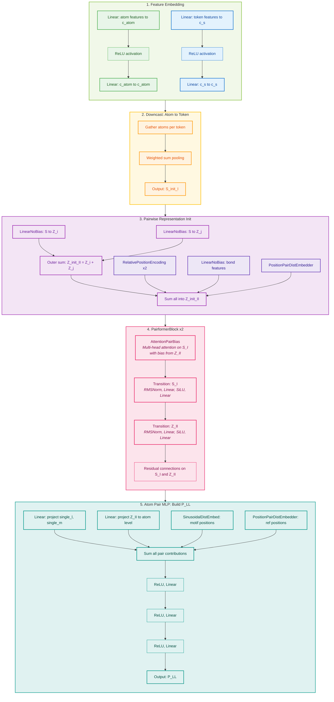
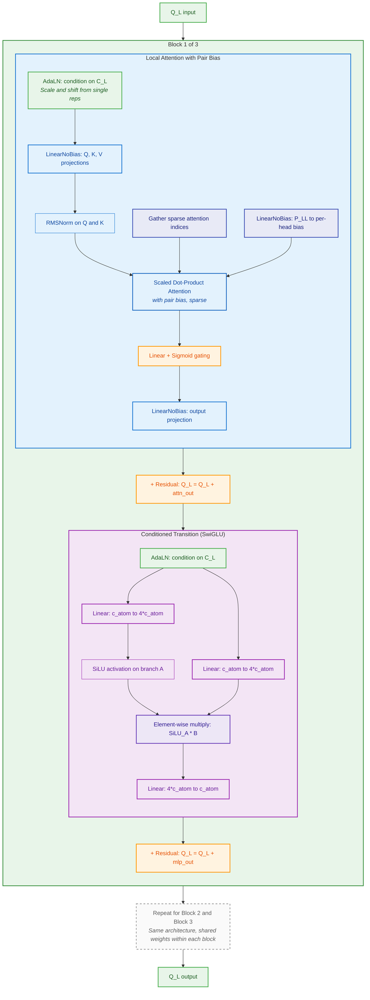
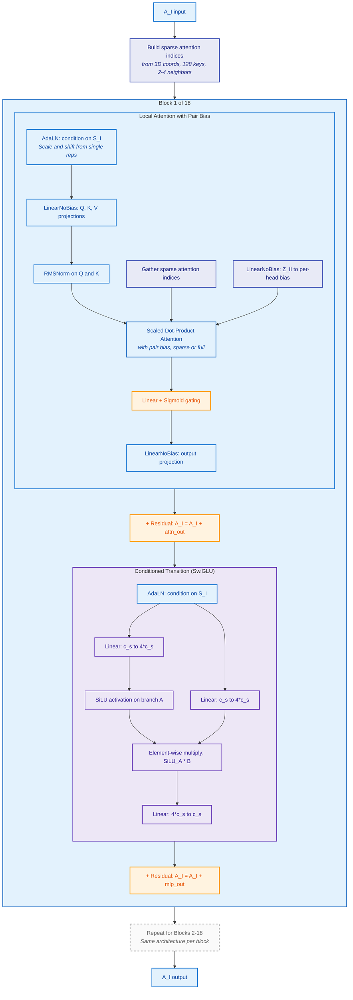
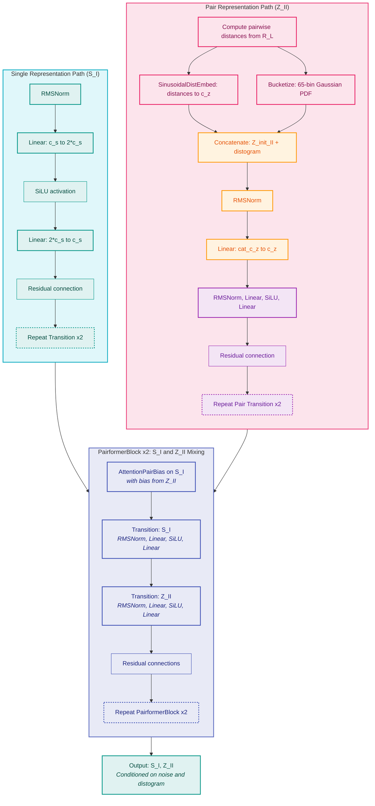

# RFD3 Model Architecture: Denoising and Recycling Loops

This document provides a detailed, code- and paper-accurate overview of the RFD3 model architecture, focusing on the interplay between the denoising (diffusion) and recycling (refinement) loops. The diagrams and descriptions below are formatted for clarity and flow, and use terminology consistent with the published paper.

## Model Flow Diagram

The following diagram shows the high-level flow of the RFD3 model, with encoder and decoder roles annotated:

```mermaid
flowchart LR
    IN[Residue features & Atomic features]
    FI[Feature Initializer<br><i>2 blocks<br><b>Encoder</b></i>]
    IN --> FI --> STEPIN[Step input<br><i>X_t, t, features</i>]
    subgraph DenoisingLoop["Denoising Loop (Diffusion)"]
        direction LR
        STEPIN --> TKINIT[Feature Initializer<br><i>2 blocks<br><b>Encoder</b></i>]
        TKINIT --> ATOM1
        subgraph RecycleLoop["Recycling (Refinement)"]
            direction LR
            ATOM1[Atom Transformer<br><i>3 blocks<br><b>Encoder</b></i>]
            TOKEN[Token Transformer<br><i>18 blocks<br><b>Encoder</b></i>]
            ATOM2[Atom Transformer<br><i>3 blocks<br><b>Decoder</b></i>]
            ATOM1 --> TOKEN --> ATOM2
            ATOM2 -- "Recycling" --> ATOM1
        end
        ATOM2 --> OUT1[Post-processing<br><i>Denoising output</i>]
        OUT1 --> OUT2[Step output<br><i>X_t-1, predictions</i>]
        OUT2 -- "More denoising steps?" --> STEPIN
    end
    OUT2 --> FINAL[Output<br><i>Final structure, metadata</i>]

    style IN fill:#e8f4fd,stroke:#2196F3,stroke-width:2px,color:#1565C0
    style FI fill:#fff3e0,stroke:#FF9800,stroke-width:2px,color:#E65100
    style STEPIN fill:#f3e5f5,stroke:#9C27B0,stroke-width:2px,color:#6A1B9A
    style TKINIT fill:#fff3e0,stroke:#FF9800,stroke-width:2px,color:#E65100
    style ATOM1 fill:#e8f5e9,stroke:#4CAF50,stroke-width:2px,color:#1B5E20
    style TOKEN fill:#e3f2fd,stroke:#1976D2,stroke-width:2px,color:#0D47A1
    style ATOM2 fill:#fce4ec,stroke:#E91E63,stroke-width:2px,color:#880E4F
    style OUT1 fill:#f3e5f5,stroke:#9C27B0,stroke-width:2px,color:#6A1B9A
    style OUT2 fill:#f3e5f5,stroke:#9C27B0,stroke-width:2px,color:#6A1B9A
    style FINAL fill:#e0f2f1,stroke:#009688,stroke-width:2px,color:#004D40
    style DenoisingLoop fill:#fafafa,stroke:#616161,stroke-width:2px,stroke-dasharray:5 5
    style RecycleLoop fill:#f5f5f5,stroke:#00BCD4,stroke-width:2px,stroke-dasharray:3 3
```

**Diagram Notes:**
- <b>Encoder</b> blocks (Feature Initializer, Atom Transformer, Token Transformer) process and encode input features and intermediate representations.
- <b>Decoder</b> block (final Atom Transformer) refines and produces the output for each recycle iteration.
- The recycling loop enables iterative refinement within each denoising step.
- The denoising loop iterates over diffusion timesteps, progressively denoising the structure.

## Block-by-Block Layer Breakdown

---

### Feature Initializer (TokenInitializer)

The Feature Initializer prepares the model's internal representations from raw input features. It embeds residue and atomic features, builds pairwise representations, and runs a small Pairformer stack for initial mixing.

- **Feature Embedding:** Two parallel paths — atom features and token features — each go through Linear + ReLU + Linear to produce initial embeddings.
- **Downcast:** Gathers atoms belonging to each token and pools them via weighted sum to produce token-level representations (S_init_I).
- **Pairwise Init:** Builds Z_init_II by outer-summing projected single reps, then adding relative position encodings, bond features, and distance embeddings.
- **PairformerBlock x2:** Each block runs AttentionPairBias on S_I (with bias from Z_II), then two separate Transition layers (RMSNorm → Linear → SiLU → Linear) for S_I and Z_II, with residual connections.
- **Atom Pair MLP:** Collects projections of single reps, Z_II, motif distances, and reference distances, sums them, then passes through 3 layers of ReLU → Linear to produce P_LL.

---

### Atom Transformer (LocalAtomTransformer, 3 blocks)

Each of the 3 blocks is a `StructureLocalAtomTransformerBlock`. The attention and MLP sub-layers are broken down below.

**Attention sub-layer:**
- **AdaLN:** Adaptive Layer Normalization conditioned on single representations (C_L). Produces scale/shift parameters.
- **Q, K, V projections:** Three separate LinearNoBias layers projecting input to query, key, and value.
- **Q/K RMSNorm:** Normalizes query and key vectors for stable attention.
- **Sparse index gathering:** Collects attention indices (nearest neighbors in 3D space).
- **Pair bias:** Projects P_LL to per-head bias via LinearNoBias, added to attention logits.
- **Scaled Dot-Product Attention:** Computes sparse attention with pair bias.
- **Sigmoid gating:** Linear → Sigmoid produces a gate that modulates the attention output.
- **Output projection:** LinearNoBias maps back to model dimension.

**MLP sub-layer (SwiGLU):**
- **AdaLN:** Conditions on C_L.
- **Two parallel Linear projections:** Both map c_atom → 4*c_atom.
- **SiLU on branch A:** Applies SiLU activation to one branch.
- **Element-wise multiply:** Multiplies the SiLU branch with the gate branch (SwiGLU pattern).
- **Linear projection:** Maps 4*c_atom back to c_atom.

---

### Token Transformer (LocalTokenTransformer, 18 blocks)

Uses the same `StructureLocalAtomTransformerBlock` as the Atom Transformer, but operates on token-level features (A_I) with pair bias from Z_II. Sparse attention indices are built from 3D coordinates (128 keys, 2-4 neighbors).

**Key differences from Atom Transformer:**
- Operates on token-level reps (A_I) instead of atom-level (Q_L).
- Pair bias comes from Z_II (token-pair) instead of P_LL (atom-pair).
- Conditioned on S_I (token single reps) instead of C_L (atom conditioning).
- Uses 128 attention keys with 2-4 spatial neighbors for sparse attention.
- 18 blocks (vs. 3 for atom transformer) — this is the largest computation in each recycle.

---

### DiffusionTokenEncoder (Self-Conditioning)

Sits between the Atom Encoder and Token Transformer. Conditions token and pair representations using noise-level and distogram information.

**Single Representation Path (S_I):**
- Two Transition layers, each: RMSNorm → Linear (expand) → SiLU → Linear (contract) → Residual.

**Pair Representation Path (Z_II):**
- Compute pairwise distances from noisy coordinates (R_L).
- Embed distances via SinusoidalDistEmbed (continuous) or 65-bin Gaussian PDF bucketing (discrete).
- Concatenate Z_init_II with distogram embedding.
- Project via RMSNorm → Linear to c_z.
- Two Pair Transition layers: RMSNorm → Linear → SiLU → Linear → Residual.

**PairformerBlock x2:**
- Each block: AttentionPairBias on S_I (bias from Z_II), then separate Transition layers for S_I and Z_II, with residual connections.
- Repeated twice for deeper mixing.

### Summary Table

| Component               | Class                    | Blocks | Key Layers                                                                 |
|-------------------------|--------------------------|--------|---------------------------------------------------------------------------|
| Feature Initializer     | TokenInitializer         | —      | 1D Embedders, Downcast, RelPos, 2 PairformerBlocks, Atom Pair MLP        |
| Atom Transformer        | LocalAtomTransformer     | 3      | AdaLN, Sparse Local Attention + Pair Bias, SwiGLU MLP, Residual          |
| DiffusionTokenEncoder   | DiffusionTokenEncoder    | —      | 2 Transitions, Distogram Embed, 2 Pair Transitions, 2 PairformerBlocks   |
| Token Transformer       | LocalTokenTransformer    | 18     | AdaLN, Sparse Local Attention + Pair Bias (128 keys), SwiGLU MLP, Residual |

All Atom Transformer and Token Transformer blocks share the same internal architecture (`StructureLocalAtomTransformerBlock`): **Local Attention with Pair Bias + Conditioned Transition (SwiGLU)**. The difference is in the number of blocks, the input level (atom vs. token), and the attention indices used.

## Step-by-Step Model Flow

This section describes the RFD3 model flow in detail, matching the diagram and paper terminology:

1. **Residue features & Atomic features:**
    - The model receives residue-level and atomic-level features as input, as shown in the paper's diagram.

2. **Feature Initializer (2 blocks, Encoder):**
    - Prepares the initial model state from the input features and coordinates.
    - Consists of 2 encoder blocks that embed and project the input data into the internal representations required for downstream processing.

3. **Step Input:**
    - Represents the current state at diffusion step $t$ (i.e., $X_t$, $t$, and features $f$).
    - This node is the entry point for each denoising (diffusion) step.

4. **Feature Initializer (2 blocks, Encoder):**
    - Initializes the state for the current denoising step.
    - Sets up the token-level and pairwise representations that will be refined in the recycling loop.

5. **Recycling (Refinement):**
    - For each denoising step, the model performs several recycling iterations to iteratively refine the representations.
    - **Atom Transformer (3 blocks, Encoder):** Processes atomic-level features, applying local self-attention and updating atom representations.
    - **Token Transformer (18 blocks, Encoder):** Processes token-level (residue-level) features, applying transformer layers to capture long-range dependencies and context.
    - **Atom Transformer (3 blocks, Decoder):** Further refines atomic features after token-level processing and produces the output for each recycle iteration.
    - The recycling loop repeats for a set number of iterations, with outputs from the final Atom Transformer feeding back to the first Atom Transformer for further refinement.

6. **Post-processing:**
    - After the final recycling iteration, the model post-processes the refined representations.
    - This typically involves scaling or transforming coordinates and preparing outputs for the next denoising step.

7. **Step Output:**
    - Produces the denoised coordinates $X_{t-1}$ and other predictions for the current step.
    - If more denoising steps remain, the output is fed back as the next step's input.

8. **Denoising Loop:**
    - The outer loop iterates over diffusion timesteps, each time running the recycling loop and post-processing.
    - The process continues until the final timestep is reached.

9. **Output:**
    - After all denoising steps are complete, the model outputs the final structure and any associated metadata or predictions.

**Key Points:**
- The recycling loop is nested inside the denoising loop, enabling multiple refinement steps per diffusion timestep.
- The architecture and terminology now match the published paper's diagram, and the diagram accurately reflects the data/control flow in the RFD3 model codebase.