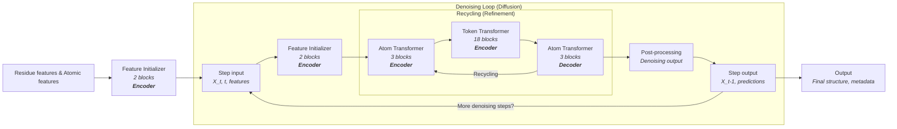
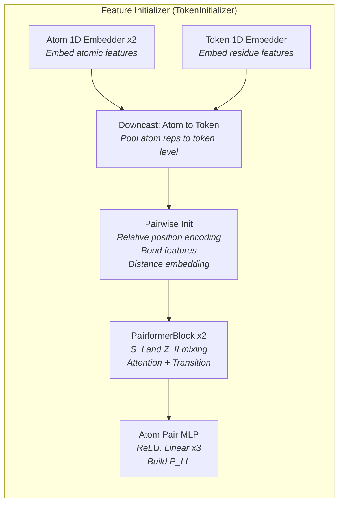
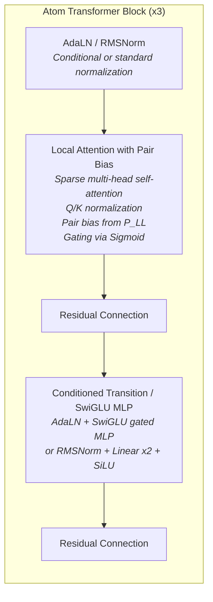
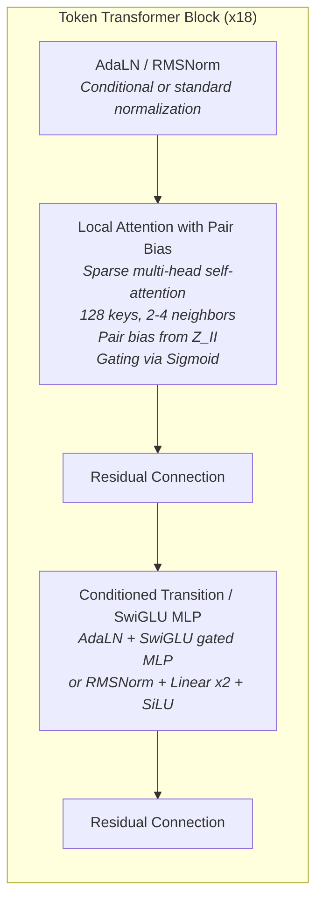
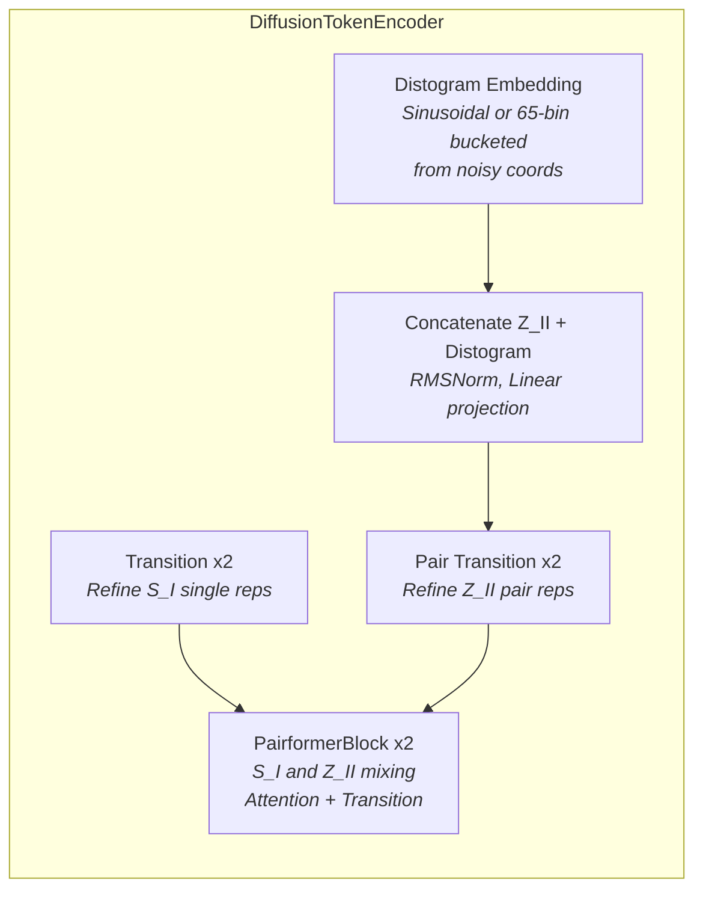

# RFD3 Model Architecture: Denoising and Recycling Loops

This document provides a detailed, code- and paper-accurate overview of the RFD3 model architecture, focusing on the interplay between the denoising (diffusion) and recycling (refinement) loops. The diagrams and descriptions below are formatted for clarity and flow, and use terminology consistent with the published paper.

---

## Model Flow Diagram

The following diagram shows the high-level flow of the RFD3 model, with encoder and decoder roles annotated:

**Diagram Notes:**
- <b>Encoder</b> blocks (Feature Initializer, Atom Transformer, Token Transformer) process and encode input features and intermediate representations.
- <b>Decoder</b> block (final Atom Transformer) refines and produces the output for each recycle iteration.
- The recycling loop enables iterative refinement within each denoising step.
- The denoising loop iterates over diffusion timesteps, progressively denoising the structure.

---

## Block-by-Block Layer Breakdown

---

### Feature Initializer (TokenInitializer)

The Feature Initializer prepares the model's internal representations from raw input features. It embeds residue and atomic features, builds pairwise representations, and runs a small Pairformer stack for initial mixing.

- **Atom 1D Embedders:** Two embedding layers that project raw atomic features into model space.
- **Token 1D Embedder:** Embeds residue-level features.
- **Downcast:** Pools atom representations to the token (residue) level.
- **Pairwise Init:** Builds initial pairwise representations using relative position encoding, bond features, and distance embeddings.
- **PairformerBlock x2:** Two Pairformer blocks that mix single (S_I) and pair (Z_II) representations via attention and transition layers.
- **Atom Pair MLP:** Builds atom-level pairwise features (P_LL) using a 3-layer ReLU + Linear MLP.

---

### Atom Transformer (LocalAtomTransformer)

The Atom Transformer processes atom-level features using sparse local attention and gated feed-forward layers. Each of the 3 blocks shares the same architecture.

- **AdaLN / RMSNorm:** Normalizes input, optionally conditioned on single representations (AdaLN-Zero style).
- **Local Attention with Pair Bias:** Sparse multi-head self-attention over atom features, using Q/K normalization and pair bias from atom-pair features (P_LL). Output is gated via sigmoid.
- **Residual Connection:** Adds the attention output back to the input.
- **Conditioned Transition / SwiGLU MLP:** Feed-forward block using AdaLN + SwiGLU gating, or RMSNorm + two linear layers with SiLU activation.
- **Residual Connection:** Adds the MLP output back to the input.

---

### Token Transformer (LocalTokenTransformer)

The Token Transformer processes token-level (residue-level) features. It uses the same block architecture as the Atom Transformer, but operates at the token level with 18 blocks and sparse attention indices computed from 3D coordinates.

- **AdaLN / RMSNorm:** Normalizes input, optionally conditioned on single representations.
- **Local Attention with Pair Bias:** Sparse multi-head self-attention over token features, using 128 attention keys and 2-4 sequence neighbors. Pair bias is derived from Z_II. Output is gated via sigmoid.
- **Residual Connection:** Adds the attention output back to the input.
- **Conditioned Transition / SwiGLU MLP:** Feed-forward block using AdaLN + SwiGLU gating, or RMSNorm + two linear layers with SiLU activation.
- **Residual Connection:** Adds the MLP output back to the input.

---

### DiffusionTokenEncoder (Self-Conditioning, between Atom Encoder and Token Transformer)

The DiffusionTokenEncoder sits between the Atom Encoder and Token Transformer. It conditions the token and pair representations using noise-level and distogram information.

- **Transition x2:** Two transition layers (RMSNorm + Linear + SiLU) to refine the single representation (S_I).
- **Distogram Embedding:** Embeds pairwise distances from noisy coordinates, using sinusoidal embedding or 65-bin Gaussian PDF bucketing.
- **Concatenate + Project:** Concatenates Z_II with the distogram embedding, then applies RMSNorm and a linear projection.
- **Pair Transition x2:** Two transition layers to refine the pair representation (Z_II).
- **PairformerBlock x2:** Two Pairformer blocks that mix single and pair representations via attention and transition layers.

---

### Summary Table

| Component               | Class                    | Blocks | Key Layers                                                                 |
|-------------------------|--------------------------|--------|---------------------------------------------------------------------------|
| Feature Initializer     | TokenInitializer         | —      | 1D Embedders, Downcast, RelPos, 2 PairformerBlocks, Atom Pair MLP        |
| Atom Transformer        | LocalAtomTransformer     | 3      | AdaLN, Sparse Local Attention + Pair Bias, SwiGLU MLP, Residual          |
| DiffusionTokenEncoder   | DiffusionTokenEncoder    | —      | 2 Transitions, Distogram Embed, 2 Pair Transitions, 2 PairformerBlocks   |
| Token Transformer       | LocalTokenTransformer    | 18     | AdaLN, Sparse Local Attention + Pair Bias (128 keys), SwiGLU MLP, Residual |

All Atom Transformer and Token Transformer blocks share the same internal architecture (`StructureLocalAtomTransformerBlock`): **Local Attention with Pair Bias + Conditioned Transition (SwiGLU)**. The difference is in the number of blocks, the input level (atom vs. token), and the attention indices used.

---

## Step-by-Step Model Flow

This section describes the RFD3 model flow in detail, matching the diagram and paper terminology:

1. **Residue features & Atomic features:**
    - The model receives residue-level and atomic-level features as input, as shown in the paper's diagram.

2. **Feature Initializer (2 blocks, Encoder):**
    - Prepares the initial model state from the input features and coordinates.
    - Consists of 2 encoder blocks that embed and project the input data into the internal representations required for downstream processing.

3. **Step Input:**
    - Represents the current state at diffusion step $t$ (i.e., $X_t$, $t$, and features $f$).
    - This node is the entry point for each denoising (diffusion) step.

4. **Feature Initializer (2 blocks, Encoder):**
    - Initializes the state for the current denoising step.
    - Sets up the token-level and pairwise representations that will be refined in the recycling loop.

5. **Recycling (Refinement):**
    - For each denoising step, the model performs several recycling iterations to iteratively refine the representations.
    - **Atom Transformer (3 blocks, Encoder):** Processes atomic-level features, applying local self-attention and updating atom representations.
    - **Token Transformer (18 blocks, Encoder):** Processes token-level (residue-level) features, applying transformer layers to capture long-range dependencies and context.
    - **Atom Transformer (3 blocks, Decoder):** Further refines atomic features after token-level processing and produces the output for each recycle iteration.
    - The recycling loop repeats for a set number of iterations, with outputs from the final Atom Transformer feeding back to the first Atom Transformer for further refinement.

6. **Post-processing:**
    - After the final recycling iteration, the model post-processes the refined representations.
    - This typically involves scaling or transforming coordinates and preparing outputs for the next denoising step.

7. **Step Output:**
    - Produces the denoised coordinates $X_{t-1}$ and other predictions for the current step.
    - If more denoising steps remain, the output is fed back as the next step's input.

8. **Denoising Loop:**
    - The outer loop iterates over diffusion timesteps, each time running the recycling loop and post-processing.
    - The process continues until the final timestep is reached.

9. **Output:**
    - After all denoising steps are complete, the model outputs the final structure and any associated metadata or predictions.

**Key Points:**
- The recycling loop is nested inside the denoising loop, enabling multiple refinement steps per diffusion timestep.
- The architecture and terminology now match the published paper's diagram, and the diagram accurately reflects the data/control flow in the RFD3 model codebase.