# RFD3 Model Architecture: Denoising and Recycle Loops

This diagram and description are based on the actual code and documentation for the RFD3 model. It shows the correct flow and nesting of the denoising (diffusion) and recycle (refinement) loops.

---

## Model Flow Diagram

```mermaid
flowchart LR
    IN[Input<br><i>Raw features, coordinates, timestep</i>]
    FI[Feature Initializer<br><i>Prepare model state from input</i>]
    IN --> FI --> STEPIN[Step input<br><i>X_t, t, features</i>]
    subgraph DenoisingLoop["Denoising Loop (Diffusion Steps)"]
        direction LR
        STEPIN --> TKINIT[TokenInitializer<br><i>Initializes state for this step</i>]
        TKINIT --> ENC
        subgraph RecycleLoop["Recycle Loop (Refinement)"]
            direction LR
            ENC[AtomEncoder<br><i>Local atom transformer</i>]
            TOK[TokenEncoder<br><i>Token-level encoder</i>]
            TR[TokenTransformer<br><i>Token transformer</i>]
            DEC[Decoder<br><i>Refinement decoder</i>]
            HD[Post Processing<br><i>Recycle output</i>]
            ENC --> TOK --> TR --> DEC --> HD
            HD -- "More recycle?" --> ENC
        end
        HD --> OUT1[Post-processing<br><i>Denoising output</i>]
        OUT1 --> OUT2[Step output<br><i>X_t-1, predictions</i>]
        OUT2 -- "More denoising steps?" --> STEPIN
    end
    OUT2 --> FINAL[Output<br><i>Final structure, metadata</i>]
```

---

## Detailed Description

This diagram represents the actual implementation and control flow in the RFD3 codebase, with the recycle loop nested inside the denoising loop. Each component and step is described below:

1. **Input:**
    - The model receives raw features (such as sequence, MSA, templates), atom coordinates, and the current diffusion timestep.

2. **Feature Initializer:**
    - Prepares the initial model state from the input features and coordinates.
    - Embeds and projects the input data into the internal representations required for downstream processing.

3. **Step Input:**
    - Represents the current state at diffusion step $t$ (i.e., $X_t$, $t$, and features $f$).
    - This node is the entry point for each denoising (diffusion) step.

4. **TokenInitializer:**
    - Initializes the state for the current denoising step.
    - Sets up the token-level and pairwise representations that will be refined in the recycle loop.

5. **Recycle Loop (Refinement):**
    - For each denoising step, the model performs several recycle iterations to iteratively refine the representations.
    - **AtomEncoder:** Applies local atom-level attention and encodes atom features.
    - **TokenEncoder:** Encodes token-level features, often aggregating information from atoms to tokens.
    - **TokenTransformer:** Applies transformer layers to token representations, enabling global or local context mixing.
    - **Decoder:** Refines the representations and prepares them for output heads.
    - **Heads:** Produces predictions such as distograms, sequence logits, and other auxiliary outputs.
    - The loop repeats for a set number of recycles, with outputs from Heads feeding back to AtomEncoder for further refinement.

6. **Post-processing (scale_positions_out):**
    - After the final recycle iteration, the model post-processes the refined representations.
    - This typically involves scaling or transforming coordinates and preparing outputs for the next denoising step.

7. **Step Output:**
    - Produces the denoised coordinates $X_{t-1}$ and other predictions for the current step.
    - If more denoising steps remain, the output is fed back as the next step's input.

8. **Denoising Loop:**
    - The outer loop iterates over diffusion timesteps, each time running the recycle loop and post-processing.
    - The process continues until the final timestep is reached.

9. **Output:**
    - After all denoising steps are complete, the model outputs the final structure and any associated metadata or predictions.

**Key Points:**
- The recycle loop is nested inside the denoising loop, enabling multiple refinement steps per diffusion timestep.
- All major modules are shown in their correct order, and the diagram accurately reflects the data/control flow in the RFD3 model codebase.