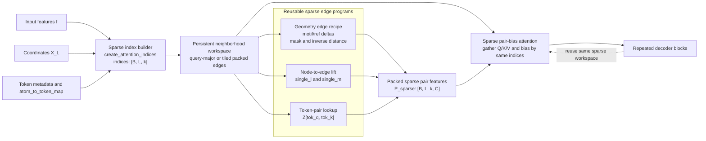

# Sparse Edge Pattern And Data Layout Map

This note summarizes the repeated sparse-edge computation patterns across the RFD3 inference path and proposes a layout-first systems view for optimization.

## Core Idea

Across the low-memory path, multiple modules follow the same high-level structure:

1. Build or consume a sparse neighborhood graph `indices` with shape `[B, L, k]`.
2. Gather query-side and key-side data along that graph.
3. Compute edge-local relations or feature transforms.
4. Materialize sparse edge features or sparse attention bias.
5. Reuse the same sparse topology across repeated decoder invocations.

This makes a strong case for a reusable sparse-edge execution abstraction rather than optimizing one function in isolation.

## Pattern Table

| Module | File | Sparse Topology Input | Edge Recipe | Output | Reuse Potential |
| --- | --- | --- | --- | --- | --- |
| Attention index construction | `rfd3/model/layers/block_utils.py` | Sequence and geometry constraints | Build `[B, L, k]` query-to-key neighborhoods | `indices` | High. Topology is often reused across decoder blocks. |
| Chunked motif/reference embedding | `rfd3/model/layers/chunked_pairwise.py` | `indices` | Gather query/key positions, compute deltas, masks, inverse-distance features | Sparse pair features `[B, L, k, C]` | Medium to high. Geometry recipe differs, but topology is reused. |
| Single feature lifting | `rfd3/model/layers/chunked_pairwise.py` | `indices` | Lift per-node features from query and key sides onto edges | Sparse pair features `[B, L, k, C]` | High. Static projections are already cached. |
| Token-pair lookup | `rfd3/model/layers/chunked_pairwise.py` | `indices` plus `atom_to_token_map` | Map atom edges to token edges and gather token-pair features | Sparse pair features `[B, L, k, C]` | High. Token mapping and processed token-pair features are mostly static. |
| Sparse pair-bias attention | `rfd3/model/layers/attention.py` | `indices` | Gather `K`, `V`, and pair bias by the same sparse graph | Attention output `[B, L, C]` | High. Same sparse topology is consumed repeatedly. |
| Atom/token regrouping | `rfd3/model/layers/block_utils.py` | Valid masks and token grouping | Repack tensors between flat atom order and grouped token layout | Layout-transformed tensors | High. Good target for persistent workspace design. |
| Pairwise pooling back to tokens | `rfd3/model/layers/block_utils.py` | Atom-to-token map | Aggregate atom-pair features into token-pair features | Token-pair features `[B, I, I, C]` | Medium. More aggregation-heavy than sparse gather-heavy. |

## Static Vs Recomputed Data

### Static or slowly changing

- `atom_to_token_map`
- token metadata such as token IDs and chain-like relations
- cached single projections in `ChunkedPairwiseEmbedder`
- cached processed token-pair features in `ChunkedPairwiseEmbedder`

### Recomputed but structurally repeated

- sparse neighborhood indices
- gathered key-side features under the same index layout
- motif/reference edge-local geometry terms
- sparse `K`, `V`, and bias gathering inside sparse attention

### Systems implication

The strongest layout-first opportunity is to build a persistent sparse neighborhood workspace that stores a packed representation of the query-to-key graph once and lets multiple decoder blocks consume it without rebuilding the same gather structure.

## Data Layout Visualization



## Layout View

Current logical representation is neighborhood-major per query:

```text
indices: [B, L, k]

for each batch b:
  for each query q in [0, L):
    neighbors(q) = [k0, k1, k2, ..., k{k-1}]
```

A layout-first persistent representation should make repeated traversal explicit:

```text
packed_edges (query-major)

tile 0:
  q0 -> [k00, k01, k02, ...]
  q1 -> [k10, k11, k12, ...]
  ...

tile 1:
  qT -> [kT0, kT1, kT2, ...]
  qT+1 -> [...]

metadata stored alongside each tile:
  - query offsets
  - packed key indices
  - query token ids
  - key token ids
  - optional relation masks
  - optional gathered static projections
```

This layout is a better starting point for:

1. persistent execution across decoder blocks
2. cache-aware query tiling
3. later kernel fusion on the residual hot path

## Minimal Prototype Boundary

If the goal is a layout-first systems prototype, the smallest useful boundary is:

1. `create_attention_indices` and related neighbor utilities in `block_utils.py`
2. `ChunkedPairwiseEmbedder.forward_chunked` in `chunked_pairwise.py`
3. `sparse_pairbias_attention` in `attention.py`

Together, these define:

- the sparse graph construction
- the sparse edge feature materialization
- the sparse edge feature consumption

That is enough to evaluate whether a persistent sparse neighborhood workspace improves locality and reduces repeated memory traffic before deciding which kernels are worth fusing.

## Capturing Matrix Structure During Inference

If you want to inspect how the matrices look during a real inference run, you can now capture them directly from the model path.

Set:

```bash
RFD3_CAPTURE_MATRIX_DIR=/tmp/rfd3_matrix_capture
```

and run inference as usual. The capture is one-shot and writes:

1. `attention_indices.pt`
  Contains the real sparse neighborhood tensor `indices` used by attention.

2. `pairwise_initializer.pt`
  Contains the dense initializer-side pair structure from the standard path:
  - `motif_valid_mask`
  - `ref_valid_mask`
  - `pair_energy` as `||P_LL||` over the feature dimension
  - `pair_nonzero_mask`
  - `token_index`

Example:

```bash
RFD3_CAPTURE_MATRIX_DIR=./logs/rfd3_matrix_capture \
rfd3 design out_dir=logs/inference_outs/common_sim_capture/0 \
inputs=models/rfd3/docs/examples/common_simulate.json \
diffusion_batch_size=1 n_batches=1 \
skip_existing=False dump_trajectories=False prevalidate_inputs=False
```

This lets you analyze both:

1. the sparse attention structure that is repeatedly consumed
2. the dense pairwise structure that is precomputed and kept alive in the standard path

You can then visualize the captured sparse structure with:

```bash
python models/rfd3/scripts/visualize_sparse_layout.py \
   ./logs/rfd3_matrix_capture/attention_indices.pt \
   ./logs/rfd3_matrix_capture/rfd3_sparse_layout.svg
```

PNG is also supported:

```bash
python models/rfd3/scripts/visualize_sparse_layout.py \
  ./logs/rfd3_matrix_capture/attention_indices.pt \
  ./logs/rfd3_matrix_capture/rfd3_sparse_layout.png
```